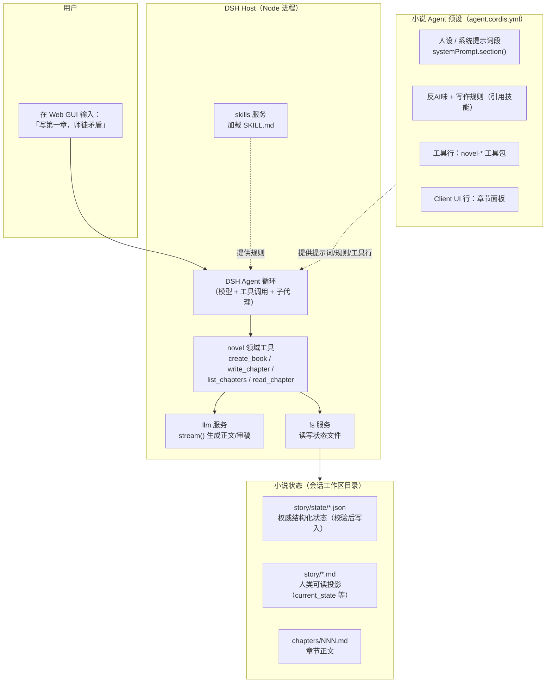
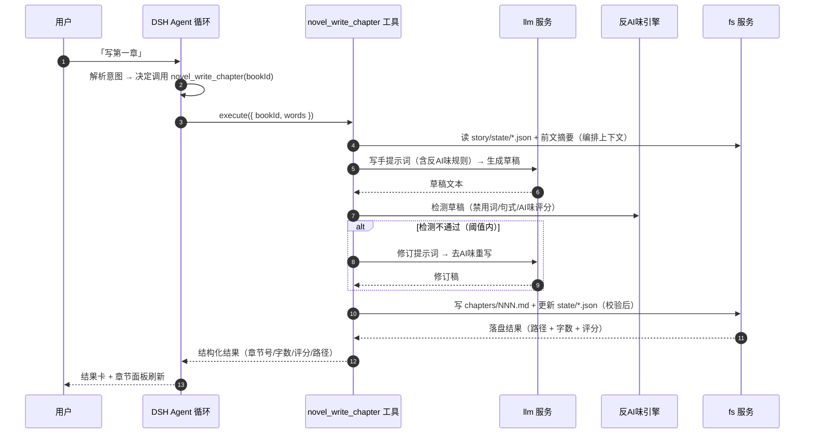
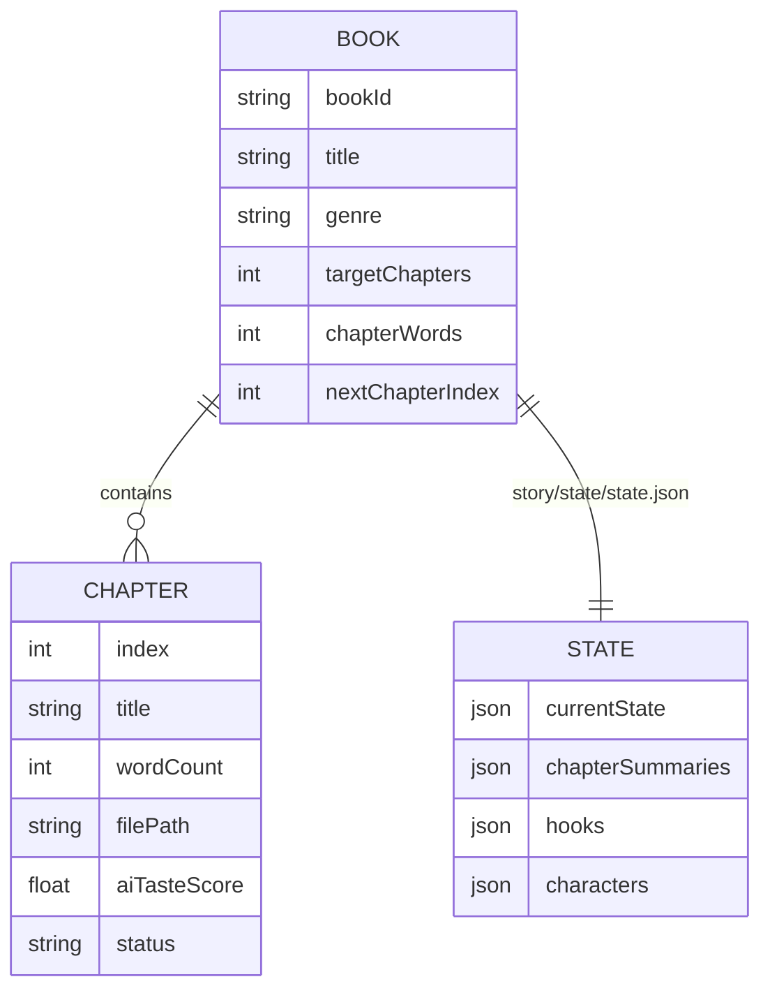

# PRD：贯通线（Tracer Bullet）—— 聚焦反 AI 味的小说 Agent 最小闭环

- **日期**：2026-08-14
- **状态**：待评审
- **作者**：DSH Agent（DeepSeek Harness）
- **前置结论**（已与作者对齐）：
  - 以 inkos 为「架构说明书 + 纯文本资产库」，**不 fork 其代码**；kealin 的 `quality.py` + 112 个测试为「反 AI 味引擎」的移植蓝本。
  - 运行地基是 **DeepSeek Harness（DSH）**，**不使用 pi**。交付形态 = **DSH 预设（preset）+ 技能（skills）+ 插件（plugins）**。
  - 主干只保留「长篇 + 短篇小说 Agent」，砍掉翻译/剧本/分镜/互动影游/Play/封面。
  - UI 形态 = **Chat 优先（A）+ 常驻工作台（C）**：对话即工作台，画布/章节侧栏作为常驻面板。

---

## 1. 概述（Introduction）

本 PRD 只定义 **一条贯通线（tracer bullet）**：在「装好小说 Agent 预设的 DSH」里，用户用一句自然语言完成一次**从意图到落盘的一章小说生产**，且 **反 AI 味规则在本次生产里真实生效**，结果在对话里可见、并能在最小侧栏里列出/查看章节。

一句话验收：**在 DSH Web GUI 里说「写一章」，得到一章「已过反 AI 味检测、已落盘、可回看」的正文。**

为什么先做贯通线：kealin 的病根是「后端模块各自精美、互相不接线、前端一半死代码」。贯通线的唯一目的，就是**先把整条链路接通**（预设 → 工具 → 状态 → 反 AI 味 → 最小 UI），证明这套地基能一起跑，再逐片长肉。

---

## 2. 目标与成功标准（Goals）

**目标：**

1. 用户能在 DSH 里用自然语言创建一本小说（或续写已有书）。
2. 用户说「写下一章」时，系统走完 `规划 → 编排 → 写作 → 反AI味审计 → 修订 → 状态结算` 的完整链路（**贯通线的核心是"链路通"，不是"写得好"**）。
3. 反 AI 味规则**在生成阶段就注入提示词**，并在落盘前**做过一次确定性检测**（禁用词/句式统计），检测结果随结果一起可见。
4. 每一章正文、以及它的结构化状态，都**落盘为工作区目录里的文件**（可回看、可 git、可迁移）。
5. 对话里能看到本次生产的**结果卡**（章节号、字数、反AI味评分、落盘路径）。
6. 一个**最小章节侧栏/面板**能列出所有章节、点开查看正文。

**成功标准（验收口径）：**

- 冷启动（全新工作区、无书）下，说「创建一本都市修仙小说《吞天魔帝》」→ 出现书目录 + 状态文件。
- 说「写第一章」→ 一次调用内完成写作 + 反AI味检测 + 落盘，对话里出现结果卡。
- 结果卡里 `反AI味评分` 字段来自**真实运行的检测器**，不是模型口头声明。
- 工作区磁盘上存在 `chapters/001.md` 与 `story/state/*.json`，内容与结果卡一致。
- 章节面板能看到刚写的这一章，点开能读正文。

---

## 3. 范围与非目标（Scope / Non-Goals）

**本次贯通线包含：**

| 项 | 说明 |
|---|---|
| 预设骨架 | 一个可加载的「小说 Agent」预设（人设 + 反AI味规则提示词段 + 工具行 + UI 行） |
| 技能包（最小） | `anti-ai-flavor`（反AI味规则）、`longform-writing`（长篇写作规则）两个 SKILL.md |
| Host 工具（最小集） | `novel_create_book`、`novel_write_chapter`、`novel_list_chapters`、`novel_read_chapter` |
| 状态层（最小） | 书/章节/伏笔骨架的 JSON 状态 + 校验 + 快照落盘 |
| 反 AI 味引擎（最小） | 确定性检测（禁用词、句式统计）+ 一次自动去AI味重写 |
| Client UI（最小） | 章节列表 + 正文阅读器面板（对话旁的常驻 Slot） |

**本次贯通线明确不做（Non-Goals）：**

- 不做**无限画布**（画布是后续子项目，贯通线只做"章节列表+阅读器"最小面板）。
- 不做**语义记忆/向量检索/SQLite**（贯通线只用「章节摘要滑动窗口」级上下文）。
- 不做**多模型路由**（贯通线全用默认模型，路由是后续子项目）。
- 不做**守护进程/后台连写多章**（`--count 5` 这类）。
- 不做**确认卡（propose_action/action surface）**——贯通线里「重动作确认」先用 DSH 的 `userQuestions.ask()` 在**建书时**做一个最小确认，其余直接执行。
- 不做**短篇**（虽然主干含短篇，但贯通线先只做长篇单章，短篇是同一工具的后续参数化）。
- 不做**翻译/剧本/分镜/互动影游/Play/封面**（永久砍掉）。
- 不做**真实 package 固化**——贯通线用**动态插件**验证设计（见 §8.5），固化进 preset/package 是评审通过后的正式设计阶段动作。

---

## 4. 整体架构（Architecture）

### 4.1 顶层组件关系



### 4.2 「写一章」的时序（核心数据流）



### 4.3 状态数据模型



**核心状态文件（映射 inkos 的三层记忆，贯通线取最小集）：**

| 文件 | 用途 | 权威性 |
|---|---|---|
| `story/state/state.json` | 结构化状态：当前进度、章节摘要列表、伏笔、角色骨架 | 权威，**每次写入前校验** |
| `story/current_state.md` | 人类可读投影 | 派生，可随时由 state.json 重生成 |
| `story/chapter_summaries.md` | 章节摘要投影 | 派生 |
| `chapters/NNN.md` | 章节正文（`001.md`、`002.md`…） | 权威正文 |

---

## 5. 用户故事（User Stories）

### US-001：建书
**描述**：作为作者，我想用自然语言创建一本小说，以便后续按书组织章节。

**验收标准：**
- [ ] 说「创建一本都市修仙小说《吞天魔帝》」→ 生成合法 `bookId`（如 `tun-tian-mo-di`，或 slug + 短 hash 防重名）。
- [ ] 落盘 `story/state/state.json`（含 bookId/title/genre/目标章节/每章字数/nextChapterIndex=1）。
- [ ] 对话里返回「已创建 + 路径」结果卡。
- [ ] 同名书已存在时，不覆盖，返回「已存在」并提示用原 bookId。

### US-002：写一章（贯通线核心）
**描述**：作为作者，我想说「写下一章」就让系统走完"规划→编排→写作→反AI味审计→修订→结算"并落盘，以便得到一章成品。

**验收标准：**
- [ ] 无书时（首次），说「写下一章」→ 引导先建书（或返回明确错误，见边界 §8）。
- [ ] 有书时，说「写下一章」→ 工具内走完 5 阶段。
- [ ] 反 AI 味规则**注入到写手提示词**（可通过结果卡的 `promptPack` 字段或调试 trace 验证）。
- [ ] 落盘前执行**确定性反AI味检测**，`aiTasteScore` 为真实计算结果。
- [ ] 检测不通过 → 自动重写一次；仍不通过 → 保留正文但结果卡标注「有残留问题」（不硬卡死）。
- [ ] 落盘 `chapters/NNN.md`，并更新 `state.json` 的 nextChapterIndex 与摘要。
- [ ] 结果卡含：章节号、字数、AI味评分、落盘路径、是否触发过自动修订。

### US-003：列章节 / 读章节
**描述**：作为作者，我想在常驻面板里看到所有章节并点开阅读，以便回看进度。

**验收标准：**
- [ ] 章节面板（Client Slot）列出全部章节（章节号 + 标题 + 字数 + 评分）。
- [ ] 点某章 → 面板内显示正文（或独立阅读器视图）。
- [ ] 面板数据来自 Host（通过 `host.call` 读状态），不自己猜。

---

## 6. 功能需求（Functional Requirements）

- **FR-1**：系统提供 `novel_create_book` 工具，入参 `title`（必填）、`genre`（可选）、`brief`（可选创作简报）；生成唯一 `bookId`，初始化状态文件。
- **FR-2**：系统提供 `novel_write_chapter` 工具，入参 `bookId`（必填）、`words`（可选目标字数）、`context`（可选本章创作指导，如「重点写师徒矛盾」）。
- **FR-3**：`novel_write_chapter` 内部按序执行 5 阶段：`plan`（生成本章意图，落到内存）、`compose`（组装上下文：控制面 + 前文摘要 + 角色骨架）、`write`（写手提示词含反AI味规则，生成草稿）、`audit`（确定性反AI味检测 + 连续性轻校验）、`revise`（检测不通过时去AI味重写一次）、`settle`（落盘正文 + 更新状态 + 生成摘要）。
- **FR-4**：反 AI 味引擎提供两个能力：`detect(text) → { score, hits[] }`（确定性检测）与 `rewrite(text, rules) → text`（LLM 去AI味重写）。
- **FR-5**：所有状态写入前执行**结构校验**（字段类型、枚举、索引连续性），校验失败**拒绝写入**并返回明确错误，绝不写坏数据。
- **FR-6**：每章落盘时同时写 `chapters/NNN.md` 与更新 `story/state/state.json`；`state.json` 写入采用「读-改-校验-写」原子步骤。
- **FR-7**：系统提供 `novel_list_chapters(bookId)` 与 `novel_read_chapter(bookId, index)` 工具，供 Agent 与 Client 面板读取。
- **FR-8**：章节面板注册在 DSH 的常驻 Slot（`conversation.session.header.actions` 放「章节」入口 + `shell.overlay` 放面板），面板通过 `host.call` 拉取章节列表/正文。
- **FR-9**：工具结果以**结构化 JSON** 返回（含章节号/字数/评分/路径/是否修订），渲染为结果卡；**完成态只来自工具返回值与文件，不从模型口头声明推断**。

---

## 7. 实现结构（Implementation Structure）

> 本节是对 DSH 真实契约的映射（已通过 `cordis_inspect_*` 查证）。所有"查证"结论以本 DSH 运行时为准。

### 7.1 交付物三件套的落点

| 交付物 | 落点 | 机制 |
|---|---|---|
| **预设** | `${DSH_HOME}/.agent-presets/<id>/agent.cordis.yml` + `preset.yml` | `agentPresets.copy('standard', id, name)` 复制后逐行编辑 |
| **技能** | 预设目录内或 `~/.agents/skills/` | `SKILL.md`（YAML frontmatter：`name`/`description` + 正文），经 `skills` 服务加载 |
| **插件（工具 + UI）** | 贯通线阶段用**动态插件**（`cordis_define`/`cordis_run`）；正式阶段固化进 DSH checkout 的 package 并被预设引用 | Host 半 = `harness.defineTool`；Client 半 = `slots.inject/register` |

### 7.2 Host 插件结构（领域工具）

Host 半是**纯 JavaScript 函数体**，返回 Cordis Plugin。骨架：

```js
return {
  inject: ['llm', 'fs'],        // 硬依赖：模型流 + 文件系统
  apply(ctx) {
    const llm = ctx.llm, fs = ctx.fs;
    // 用 ctx.get('userQuestions') 可选做建书确认
    const tools = ctx.get('tools');        // 可选，restrict/guard 用
    const slotsService = ctx.get('slots'); // 仅 Client 用，Host 不需要

    harness.registerTool(ctx, harness.defineTool({
      name: 'novel_write_chapter',
      description: 'Write the next chapter of a book, running plan→compose→write→audit→revise→settle. Anti-AI-flavor rules are enforced.',
      parameters: { /* JSON schema：bookId, words, context */ },
      output: { schema: { /* 结构化结果 */ }, render(_a, v) { return [{ type: 'text', text: /* 摘要 */ }] } },
      async execute(args) {
        // 1. 读状态  fs.readText(stateTarget)
        // 2. 编排上下文（控制面 + 前文摘要 + 角色骨架）
        // 3. llm.stream(写手提示词) → 草稿
        // 4. 反AI味 detect(草稿)
        // 5. 若不通过 → llm.stream(修订提示词) → 修订稿
        // 6. 校验 + 写正文 + 更新 state（读-改-校验-写）
        return { chapterIndex, wordCount, aiTasteScore, path, revised };
      },
    }));
    // ... 同法注册 novel_create_book / novel_list_chapters / novel_read_chapter
  },
};
```

**关键实现约束（已查证）：**

- 工具注册必须属于当前插件 Fiber，`harness.registerTool(ctx, ...)` 返回的 disposer 交给 `ctx.effect`，保证 stop/update 自动卸载。
- 模型调用走 `ctx.llm.stream(options)`（`llm` 是抽象适配器 + 流式 API）；写手/审计/修订是**同一工具内部三次带不同角色提示词的 LLM 调用**，不是三个独立 DSH 子代理（这是贯通线的实现选择，见 §9 决策 D-3）。
- 文件落盘走 `ctx.fs`：`resolve(path)` → `writeText(target, content)` / `readText(target)` / `listDir(target)`。**不要**用裸 `require('fs')` 或 shell（DSH Host 无 Node 全局）。
- 状态校验用**手写纯 JS 校验函数**（DSH 动态插件不能 `import` zod）；校验逻辑参考 inkos 的 `applyRuntimeStateDelta` + `validateRuntimeState` 语义，但用 `typeof`/`Array.isArray`/枚举白名单实现。
- `bookId` 一律先过**安全校验**（只允许 `[a-z0-9-_]`，拒绝 `..`、`/`、绝对路径），防路径穿越。

### 7.3 反 AI 味引擎结构（纯函数模块）

反 AI 味引擎是**可独立测试的纯函数**，不依赖 LLM：

```js
// detect(text) -> { score, hits[] }   —— 确定性，可单元测试
//   - 禁用词表扫描（命中一个扣分 + 记录命中位置）
//   - "的"字密度（> 阈值扣分）
//   - 句长方差（过小 = 句式单调，扣分）
//   - 排比三连 / 段尾抒情 等结构规则
// rewrite(text, rules) —— 需要 LLM，由工具注入修订提示词调用 llm.stream
```

移植蓝本 = kealin 的 `quality.py`（`calculate_ai_taste_score` 等）+ 其 `tests/test_quality.py`。**阈值和词表做成唯一数据源**（写进技能/常量，前后端不各存一份——这正是 kealin 的教训：阈值 0.05 vs 0.06 双份漂移）。

### 7.4 Client 插件结构（章节面板）

Client 半同样纯 JS，React 用 `React.createElement`（**不能 JSX、不能 import**）：

```js
return {
  apply(ctx) {
    const slots = ctx.get('slots');
    if (slots === undefined) return;

    // 1. 章节入口按钮：注册到会话头部动作条（additive，不替换整个 header）
    slots.inject('conversation.session.header.actions', () => slots.register(
      { name: 'conversation.session.header.actions', id: 'novel-chapters', label: '章节' },
      (props) => React.createElement(ChapterButton, { onOpen: () => open() }),
    ));

    // 2. 面板本体：注册到 frame 级浮层（可拖拽、可关闭）
    slots.inject('shell.overlay', () => slots.register(
      { name: 'shell.overlay', id: 'novel-chapters-panel', label: '章节面板' },
      (props) => React.createElement(ChapterPanel, { host }),
    ));

    // 3. ChapterPanel 内部：host.call('list_chapters', { bookId }) 拉数据
    //    host.call('read_chapter', { bookId, index }) 读正文
  },
};
```

**关键实现约束（已查证）：**

- 面板数据**必须走 `host.call`（Client→Host JSON RPC）**，由 Host 侧 `harness.handle('list_chapters', ...)` 提供；Client 不直接碰文件系统。
- **画布在贯通线不做**；但已确认：动态插件 Client 无法 `import` React Flow 等库。后续做画布时二选一：(a) 手搓 SVG/绝对定位的节点-连线，(b) 升级为「checkout 内的 bundled client plugin」以引入第三方图库。这是 §9 的开放决策 D-5。
- Slot 选择遵循"最窄入口"：章节按钮用 `conversation.session.header.actions`（list，additive），面板用 `shell.overlay`（list，frame 级浮层）；**不替换** `sidebar`（single，替换会吞掉工作区/设置整列）。

### 7.5 预设结构（agent.cordis.yml 要点）

贯通线阶段先**用动态插件跑通**，预设文件作为「目标结构」先写好草案：

```yaml
# ~/.dsh/.agent-presets/kealin-novel/agent.cordis.yml（草案）
- id: novel-tools          # Host 领域工具（正式阶段 = @deepseek-ai/dsh-tool-kealin 包）
  name: '@deepseek-ai/dsh-tool-kealin'
- id: novel-ui             # Client 章节面板（正式阶段 = 对应 client 包）
  name: '@deepseek-ai/dsh-client-kealin'
- id: novel-prompt         # 人设 + 反AI味提示词段（systemPrompt.section）
  name: '@deepseek-ai/dsh-prompt-kealin'
```

> 注：预设里每一行引用的必须是**真实存在的包名**。贯通线用动态插件验证「工具/UI 的形状」，验证通过后，正式设计阶段才把这些动态实现**固化**成 DSH checkout 里的 package，并让预设引用它们。**动态插件只是探针，不是交付物。**

---

## 8. 边界与临界情况（Edge Cases）

| # | 场景 | 预期行为 |
|---|---|---|
| E1 | **首次使用，直接说「写下一章」** | 无默认书 → 不瞎编书，返回明确错误或提示「请先创建一本书」 |
| E2 | **多本书并存，未指明 bookId** | 若会话只有一本书 → 自动选它；多本书 → 用 `userQuestions.ask()` 让用户选，或报错要求指明 |
| E3 | **同名书重复创建** | 不覆盖，返回「已存在」+ 原 bookId |
| E4 | **bookId 含 `../`、`/`、绝对路径、非法字符** | 拒绝，报「unsafe bookId」；对应 inkos 的 400 unsafe id |
| E5 | **LLM 调用失败 / 超时 / 429 限流** | 重试（可配次数）；最终失败则返回明确错误，**错误文本不写入正文**（kealin 的教训：错误不能流进小说） |
| E6 | **正文流式输出中断** | 已收到的部分内容保留，返回「部分内容 + 未完成」标记，可重试续写 |
| E7 | **模型返回空正文** | 不落盘空文件，报错并允许重试 |
| E8 | **字数治理** | `words` 是目标值，推导允许区间；超了不硬截断，落盘并在结果卡标 `lengthWarning`；中文按 `zh_chars`、英文按 `en_words` |
| E9 | **反AI味检测不通过** | 自动重写**一次**；仍不通过 → 保留正文 + 结果卡标注「残留问题」，不无限循环 |
| E10 | **反AI味检测的阈值/词表** | 唯一数据源（技能/常量），前端不复制第二份（kealin 教训） |
| E11 | **并发写同一本书**（两个会话同时 `write_chapter`） | 落盘前加**文件锁/占用检查**；冲突返回 `BOOK_BUSY`（映射 inkos） |
| E12 | **state.json 损坏 / 校验失败** | 拒绝写入，报错并提示修复，**绝不滚雪球写坏数据** |
| E13 | **章节号边界** | 第 0 章 / 负号 / 超大号 → 拒绝；重写历史章节另走 `novel_rewrite`（本次不做） |
| E14 | **中断恢复** | 每章结算时写**快照**（含正文与状态）；下次启动可回滚到上一章快照（贯通线做最小快照，不展开全量回滚） |
| E15 | **上下文膨胀** | 只注入「最近 N 章摘要 + 当前状态」而非全文；N 可配，默认 5 |
| E16 | **中文/英文混排计数** | 按语言探测选择 zh_chars / en_words，避免字数误判 |
| E17 | **面板无书时** | 章节面板显示空态「尚无书籍」，不是报错 |
| E18 | **host.call 失败 / Host 插件未运行** | 面板显示「连接失败」，不白屏 |

---

## 9. 设计决策与开放问题（Design Decisions & Open Questions）

> 每个开放问题附**我的推荐答案**，评审时你只需确认/否决。

- **D-1（已定）**：inkos 只当「架构说明书 + 资产库」，不 fork 代码。
- **D-2（已定）**：地基用 DSH，不用 pi；交付 = 预设 + 技能 + 插件。
- **D-3（推荐）**：inkos 的「多 Agent 角色」（Writer/Auditor/Reviser…）在 DSH 里实现为**工具内部带角色提示词的多次 `llm.stream()` 调用**，而非多个 DSH 子代理。理由：共享同一份状态、开销低、与 inkos 的 pi BaseAgent 机制同构（pi 的 agent 也是代码级角色对象）。
  - 备选：用 DSH `subagents` 让每个角色成为独立子代理。更"真 agent"，但贯通线阶段过重、状态共享复杂。→ **留待后续子项目再评估。**
- **D-4（推荐）**：状态落盘位置 = **当前会话工作区目录**下的 `novels/<bookId>/`（每本书一个子目录）。理由：随工作区走、可 git、可迁移、与 DSH 沙箱语义一致。
  - 备选：全局 `~/.dsh/novels/`（跨工作区共享，但脱离工作区、易被沙箱挡住）。
- **D-5（开放）**：画布的前端实现。动态插件无法 import 图库，做画布时要选：(a) 手搓 SVG 节点连线，(b) 升级为 checkout 内 bundled client plugin 以引入 React Flow。→ **推荐先 (a) 手搓最小版**，证明交互后再决定是否 (b)。贯通线不做画布，故此项不阻塞。
- **D-6（开放）**：反 AI 味「检测不通过」是"自动重写一次"还是"每次生成前就用约束提示词锁死 + 落盘只标注"。→ **推荐：两段都做**（生成时注入规则 + 落盘前确定性检测 + 最多一次自动重写），与 inkos 一致。
- **D-7（开放）**：新项目命名与代码仓库落点。贯通线产出物暂时落在 `D:\github项目\AI小说\prd\` 与工作区；正式实现（preset + 动态插件 + 后续 package）的目录/仓库结构待定。→ **推荐：新开一个 `kealin-dsh`（暂名）目录作为项目根**，把预设、技能、插件源码、测试、文档都收进去。

---

## 10. 成功指标（Success Metrics）

- 冷启动到「得到第一章成品」≤ 1 次对话往返（不含建书）。
- `novel_write_chapter` 一次调用的端到端成功率 ≥ 95%（无网络/限流故障时）。
- 反AI味检测结果与「人工抽查正文的 AI 味感受」方向一致（抽 3 章主观验证）。
- 状态文件 100% 通过结构校验；任何坏数据不落盘（以测试覆盖）。
- 章节面板在「无书 / 1 书 / 多书」三态下均不白屏。

---

## 11. 参考资产（来自 inkos / kealin，仅借鉴不复制代码）

| 资产 | 来源 | 用途 |
|---|---|---|
| 章节流水线阶段划分（plan→compose→write→audit→revise→settle） | inkos `pipeline/runner.ts` 的设计 | FR-3 阶段划分 |
| 三层记忆 / 状态+投影分离 | inkos `state/` + `models/runtime-state.ts` | §4.3 状态模型 |
| `applyRuntimeStateDelta` + `validateRuntimeState` 语义 | inkos `state/state-reducer.ts` | FR-5 校验写入 |
| 反AI味：禁用词表 / 句长 / 的密度 / 排比 / 段尾抒情 | kealin `quality.py` + inkos `ai-tells` | §7.3 引擎 |
| 字数治理（zh_chars / en_words + 允许区间） | inkos `length-metrics` | E8 |
| 创作规则 ~25 条 / 题材指南 | inkos `genres/*.md` + writer 提示词 | 技能包内容 |
| `tests/test_quality.py`（112 个测试之一部分） | kealin | 反AI味引擎的测试蓝本 |
